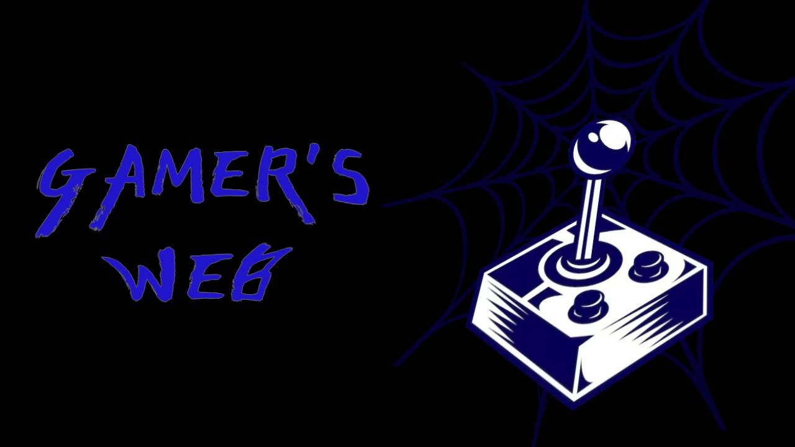

# Forum Gamer's Web

## 💡 Sobre o Projeto

É um Projeto de forum realizado em Laravel com a assistência do professor André Cassulino de Técnicas Avançadas de Programação , pelos alunos 
Matheus Araujo e Ian Moura, do curso de ADS da Fatec Sorocaba, módulo AMS.
 Realizamos um forum sobre jogos onde os usuários podem interagir entre si para discutir sobre jogos novos e velhos, fáceis e difíceis, ruins e bons. É um projeto voltado para os "gamers", tendo varios tópicos e assuntos sobre o que nos faz feliz. 
 Observação: Não traduzimos os erros de validação do Laravel com Inteligência Artificial. Nos baseamos no projeto do programador [Rafael Laurindo](https://github.com/rafaellaurindo/laravel-traducao-pt-br/blob/master/validation.php).

### Hierarquia
Possuimos três classes de usuário: moderador, usuário registrado e visitante.
 O moderador tem o dever de manter o forum funcionando de maneira agradavel para todos, resolvendo problemas e ajudando outros membros.
 O usuário registrado pode interagir como você espera, mas não pode acessar ferramentas de moderador como lista de usuários e  gerir denúncias.
 Os visitantes não podem interagir, apenas visualizar.

### Login de moderador
Email: moderador@gmail.com
Senha: 12345678

### Feito com

## 💻 Pré-requisitos

Ter o visual studio code instalado 👍

## 🚀 Rodando o projeto localmente

Atualmente, só é possível rodar o projeto localmente, com os arquivos em seu computador. Para que consiga rodar e usufruir do projeto, siga estas etapas:

### Baixando diretamente pelo github
1. Baixe o projeto aqui clicando no botão verde escrito "<>CODE" e então em "Download ZIP"
2. Extraia o ZIP num local apropriado
3. Com o Visual Studio Code, abra a pasta "forum"
4. Dentro do Visual Studio, abra o terminal (Crtl + Shift + ') e digite "php artisan serve"
5. Quando estiver tudo pronto aparecerá uma mensagem dizendo que o servidor está rodando no seu ip. Segure Crtl e clique no ip para abrir o projeto(Alternativamente você pode copiar e colar o ip no seu navegador).

### Baixando pelo Git Clone
1. Crie uma pasta de qualquer nome na localização desejada e abra ela com o Visual Studio
2. Abra o terminal(Crtl + Shift + ')  e digite o seguinte: Git clone https://github.com/matheusaraujo121/forum.git 
3. Quando ele terminar de transferir os arquivos,  abra a pasta forum com o Visual Studio
4. Digite no terminal "php artisan serve"
5. Quando estiver tudo pronto aparecerá uma mensagem dizendo que o servidor está rodando no seu ip. Segure Crtl e clique no ip para abrir o projeto(Alternativamente você pode copiar e colar o ip no seu navegador).

## 📫 Contribuindo para o Forum Gamer's Web

Para contribuir com nosso projeto, siga estas etapas:

1. Bifurque este repositório.
2. Crie um branch: `git checkout -b <nome_branch>`.
3. Faça suas alterações e confirme-as: `git commit -m '<mensagem_commit>'`
4. Envie para o branch original: `git push origin <nome_do_projeto> / <local>`
5. Crie a solicitação de pull.

Como alternativa, consulte a documentação do GitHub em [como criar uma solicitação pull](https://help.github.com/en/github/collaborating-with-issues-and-pull-requests/creating-a-pull-request).
